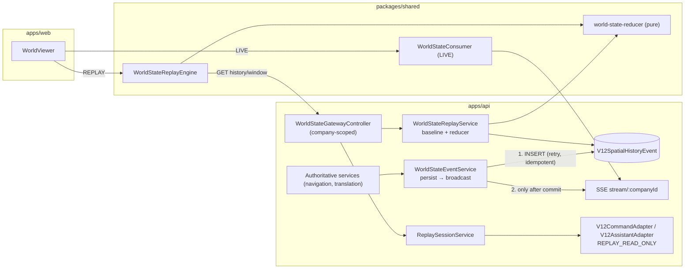

# AEVORA V12 — PERSISTENT INTELLIGENCE & IMMERSION REPORT

Milestone: **V12-C Persistent Intelligence & Immersion** (absorbs the remaining Phase 5B acceptance requirements).
This report supersedes `AEVORA_V12_PHASE_5B_COMPLETION_REPORT.md`, which overstated completion (e.g. `getSnapshotAt` was a stub and history writes were failing silently). No Phase 5C work was started.

Legend: **VERIFIED** = implemented and covered by passing automated tests. **IMPLEMENTED** = in code and compiled, but with no automated test (manual/browser verification still pending). **LIMITATION** = known gap.

---

## 1. Architecture

- **One reducer for every reconstruction.** [world-state-reducer.ts](packages/shared/src/v12/consumer/world-state-reducer.ts) is pure and deterministic. Backend reconstruction and the client replay engine both use it, so they produce the same state from the same history.
- **Baselines are reconstruction anchors.** A `WORLD_BASELINE` event stores the full authoritative spatial projection: entities, topology, navigation nodes and movement states. Historical state at any point is the latest baseline at or before that point plus every contiguous event after it.
- **Per-company sequence.** Every event has a contiguous per-company `sequence`, unique on `(companyId, sequence)`.

## 2. Capability status

| # | Capability | Status |
|---|---|---|
| 1 | Persistence safety: persist then broadcast, failures surfaced | **VERIFIED** |
| 2 | Historical reconstruction (timestamp / sequence / event, entity, company) | **VERIFIED** |
| 3 | Replay engine (play, pause, stop, seek, speed, jumps, reset, stepping) | **VERIFIED** |
| 4 | LIVE/REPLAY isolation | **VERIFIED** for engine and backend; **IMPLEMENTED** for UI wiring |
| 5 | Backend `REPLAY_READ_ONLY` command security | **VERIFIED** |
| 6 | Historical entity inspection, no current-state fallback | **VERIFIED** for backend and engine; **IMPLEMENTED** for UI |
| 7 | Correlation/causation tracing | **VERIFIED** |
| 8 | Multi-company security | **VERIFIED** (controller and service level) |
| 9 | All test failures fixed (no tests deleted) | **VERIFIED** |
| 10 | Replay UI | **IMPLEMENTED** (type-checks and builds; not browser-tested) |
| 11 | Bounded queries, indexes, retention | **VERIFIED** for limits and retention logic; indexes are in schema and migration |
| 12 | Final audit | Done (section 13) |

## 3. History persistence (`world-state-event.service.ts`)

- **Commit order.** `broadcastEvent` assigns a sequence, **persists first**, and only broadcasts after the database commit succeeds. It returns `HistoryCommitResult` with status `COMMITTED`, `RECOVERED` or `DUPLICATE`.
- **On persistence failure:**
  - No broadcast happens.
  - A typed `SpatialHistoryPersistenceError` is thrown.
  - The error is published on `persistenceFailures()` and counted in `getHistoryHealth()`.
  - The replay service schedules a recovery baseline so later history is reconstructable again. That scheduling runs outside tests only.
- **Retries.** Up to `V12_HISTORY_PERSIST_MAX_ATTEMPTS` (default 3), with linear backoff.
- **Idempotency.** A unique-key violation on `eventId` resolves to:
  - `DUPLICATE` when the event was already broadcast, so it is not broadcast again;
  - `RECOVERED` when an earlier ambiguous write actually landed, so it is broadcast exactly once.
  An `eventId` reused for a different event is rejected.
- **Sequence collision.** The commit fails without broadcasting, and the counter re-seeds from the database.
- **Ordering.** Commits are serialized per company, so persisted order, broadcast order and sequence order are the same.
- **Restart.** Sequences are seeded from `max(sequence)` per company. Wall-clock seeds were removed.
- **Callers.** Navigation now `await`s the commit, so failures propagate. The translation service routes through an `emit()` helper that logs failures without fabricating anything.

## 4. Historical reconstruction (`world-state-replay.service.ts`)

- **API calls:**
  - `getWorldState(companyId, target?)` returns `CURRENT` (live projection) **only when no target is given**.
  - With a target it returns `HISTORICAL` or `NOT_AVAILABLE`, and never substitutes current state.
  - Targets: `timestamp`, `sequence` or `eventId`. More than one target is rejected with 400.
  - Other calls: `getSnapshotAt` (by timestamp), `getEntityAt`, and `reconstruct` (sets provenance: baseline id, sequence and time, applied-event count, target sequence, partial entity ids).
- **Timestamp collisions.** The target resolves to the greatest sequence whose timestamp is at or before the target, so events sharing a timestamp are applied deterministically in sequence order.
- **Partial entities.** Entities without a recorded full transform or visibility are tracked as `partialEntityIds`. No positions are invented for them.
- **Deterministic `NOT_AVAILABLE` reasons:**
  - `NO_BASELINE_BEFORE_TARGET`
  - `NO_HISTORY_BEFORE_TARGET`
  - `EVENT_NOT_FOUND`
  - `SEQUENCE_NOT_FOUND`
  - `HISTORY_GAP`
  - `WINDOW_TOO_LARGE`
  - `BEYOND_RETENTION`
  - `FUTURE_TARGET`
  - `ENTITY_NOT_PRESENT_AT_TARGET`
  - `HISTORY_STORE_UNAVAILABLE`
- **Baselines.** Captured by `POST history/baseline/:companyId`, by hourly maintenance for companies with events newer than their latest baseline, and after persistence failures.

## 5. Replay engine (`packages/shared/src/v12/consumer/replay-engine.ts`)

- **Model.** Cursor-based and renderer-independent, with an injectable scheduler for deterministic tests. Every seek rebuilds state from the window start, so the same position always yields the same state.
- **Transport controls:** `play`, `pause`, `stop`, `setSpeed` (0.25–16×; other values throw), `seek` / `jumpToTimestamp`, `jumpToEvent`, `jumpToSequence`, `stepForward`, `stepBackward`, `reset`.
- **States.** Includes `NOT_AVAILABLE` and `ERROR`. It exposes no state when history is unavailable.
- **I/O.** The only network call is `GET /world-state/history/window/:companyId`. A test asserts that no live or mutation endpoints are called.

## 6. LIVE/REPLAY isolation

- **Separate sources.** LIVE uses `WorldStateConsumer` (snapshot plus SSE). REPLAY uses `WorldStateReplayEngine` (history window). They share no state objects.
- **No replayed event reaches live.** The SSE stream only carries events from `broadcastEvent`. Replay windows are read from the database and never re-emitted.
- **UI.** [WorldViewer.tsx](apps/web/components/v12-world/WorldViewer.tsx) creates a **fresh instance per mode session** and disposes it on switch. It clears all rendered state on every switch. In REPLAY, topology, nodes and movement states come from the engine; the old code mixed in live `consumer.getMovementStates()`, and that is removed.
- **Consumer and baselines.** The consumer ignores `WORLD_BASELINE` payloads; they only advance the sequence.

## 7. Command security

- **Server-side replay sessions.** `ReplaySessionService` keeps sessions per actor with a TTL (`V12_REPLAY_SESSION_TTL_MS`, default 30 min). Endpoints: `POST`, `DELETE` and `GET /world-state/replay/session/:companyId`. Loading a history window refreshes the session.
- **Rejection.** `V12CommandAdapter` and `V12AssistantAdapter` return **`REPLAY_READ_ONLY`** when the client sends `mode=REPLAY` **or** the server session is active. A client that claims LIVE, or omits mode, is still rejected. The check runs before any Prisma, navigation or business call, and tests assert those calls are not made.

## 8. Historical inspection

- **Backend.** `GET history/entity/:companyId/:entityId?timestamp|sequence|eventId` returns the reconstructed entity, or `ENTITY_NOT_PRESENT_AT_TARGET`. It never returns live data for a historical target.
- **UI.** [HistoricalInspector.tsx](apps/web/components/v12-world/HistoricalInspector.tsx) reads only `engine.getEntity()`. Missing fields show "not recorded" and absent entities show "did not exist at this point". The live `UIOverlay` selection is suppressed in REPLAY.
- **Voice.** In REPLAY, `ExecutiveVoice` answers "who/what is this" from the replay engine. It blocks navigation, consequential intents and live lookups, and surfaces the backend's `REPLAY_READ_ONLY`.

## 9. Correlation / causation tracing

- **Endpoint.** `GET history/trace/:companyId/:eventId` walks the persisted `causationId` chain (depth at most 25, with a cycle guard). It also lists direct effects (events whose `causationId` is this event) and events with the same `correlationId` (at most 200 each, with a truncation flag).
- **No invented links.** A `causationId` that is not in spatial history is returned as `unresolvedCausationId`.
- **Scope.** Every lookup is filtered by `companyId`, so a shared correlationId never crosses companies (tested).

## 10. Company isolation

- **Controller.** Every world-state route (snapshot, state, history snapshot, entity, events, window, trace, baseline, health, the three replay-session routes, and stream) calls `scope()`:
  - no `req.user` → **401**;
  - `req.user.companyId !== :companyId` → **403**, before any service is touched.
  `req.user.companyId` comes from the existing global `JwtAuthGuard`, including the validated `x-company-id` chairman context.
- **Service.** Every Prisma query in the replay service includes `companyId`; a test asserts this for every recorded call. Company A cannot resolve B's eventId (`EVENT_NOT_FOUND`), and B's reconstruction contains only B's entities.
- **SSE.** Uses `@StreamTokenAuth()` with short-lived stream tokens; the session JWT is never put in the URL.

## 11. Timeline UI

[ReplayTimeline.tsx](apps/web/components/v12-world/ReplayTimeline.tsx) and [replay.module.css](apps/web/components/v12-world/replay.module.css) provide:

- LIVE/REPLAY switch;
- window presets (15m, 1h, 6h, 24h);
- seek slider with event tick marks;
- reset, step back, play/pause, step forward, stop, speed select;
- jump to a timestamp (`datetime-local`);
- jump to an event by id or sequence;
- event list with click-to-jump and a **trace** action;
- banners for `NOT_AVAILABLE` (with reason), `ERROR`, effective-start and truncation notices;
- a provenance line and a partial-entities notice.

Entities lacking recorded spatial data are not rendered. `EntityMesh` would otherwise default them to the origin.

Other web fixes in the world area:
- removed hard-coded `comp_1` and `localhost:3002`, using the real `API_BASE`, JWT and company context ([worldContext.ts](apps/web/components/v12-world/worldContext.ts));
- `ExecutiveVoice` used a non-existent `/api` proxy and the wrong token key;
- `UIOverlay` referenced a non-existent `ConnectionState.CONNECTING`;
- `WorldRenderer` was missing its `THREE` and `MovementState` imports;
- `EntityMesh` set rotation on materials instead of meshes.

`tsc --noEmit` on `apps/web` reports **0 errors in `components/v12-world`**.

## 12. Performance / retention

- **Schema.** `V12SpatialHistoryEvent` has required `companyId` and `BigInt` `sequence`.
  - Unique constraints: `@@unique([companyId, sequence])` and `eventId`.
  - Indexes: `[companyId, authoritativeTimestamp, sequence]`, `[companyId, entityId, sequence]`, `[companyId, eventType, sequence]`, `[companyId, correlationId]`, `[companyId, causationId]`.
  - Migration: `packages/database/prisma/migrations/20261004180000_v12_spatial_history_event/migration.sql`.
- **Query bounds:**

  | Query | Default | Maximum | Configured by |
  |---|---|---|---|
  | Event page | 500 | 5000 | built-in; detects truncation via `limit+1` and returns `nextAfterSequence` |
  | Reconstruction | — | 20000 events after the baseline | `V12_HISTORY_MAX_RECONSTRUCTION_EVENTS` |
  | Replay window | — | 5000 events | `V12_HISTORY_MAX_WINDOW_EVENTS` |
  | Trace lists | — | 200 per list | built-in |

- **Spatial-history retention.** This is **separate from enterprise business-data retention**.
  - `V12_SPATIAL_HISTORY_RETENTION_DAYS` (default 30) applies only to `V12SpatialHistoryEvent`. Business records (employees, departments, finance and so on) are never touched by it.
  - Purge keeps the newest baseline older than the cutoff, so the retention boundary stays reconstructable. Older points return `BEYOND_RETENTION`.
- **Environment variables.** All are documented in `.env.example`.

## 13. Final audit

I searched the V12 API, shared and web code (excluding specs) for: `TODO`, `FIXME`, `stub`, `placeholder`, `hard-coded`, `comp_1`, `localhost:3002`, `fake`, `Date.now()` seeds, and `fallback`.

- **Removed:**
  - the stubbed `getSnapshotAt` (it always returned `NOT_AVAILABLE`);
  - the swallowed persistence error;
  - the `Date.now()` sequence seed;
  - hard-coded company and API URLs;
  - live movement data mixed into replay;
  - the string-token DI hack in the controller spec.
- **Remaining matches are benign:**
  - an input `placeholder` attribute;
  - `Suspense fallback`;
  - a comment saying no company is hard-coded;
  - LIVE-path navigation and spatial comments ("fallback to workspace location", "department mapping fallback"). These are about current-state movement resolution, not history.

## 14. Tests

| Command | Result |
|---|---|
| `npx jest src/v12-spatial src/world-state-gateway` (apps/api) | **9/9 suites, 144/144 tests passed** |
| `npm test` (apps/api, full) | **22/22 suites, 174/174 tests passed** |
| `npx jest` (packages/shared) | **5/5 suites, 37/37 tests passed** |
| **Total** | **30 suites, 227 tests, 0 failures** |

The audit had reported 21 passing and 11 failing. The 11 failures were fixed **without deleting any test**:

- **Controller spec (3).** Dependency injection was missing `WorldStateReplayService`. The spec now uses real class tokens and passes authenticated requests.
- **Event service spec (4).** Dependency injection was missing `PrismaService`.
- **Assistant spec (4).** The mocks did not match the real Prisma schema. They now use `Employee.name` and `Role.title`, department spaces come from `V12SpatialRoom.findFirst`, and mocks reset with empty defaults between tests. **Adapter behaviour was not changed or weakened.**

New and extended coverage:

- **`world-state-event.service.spec.ts`** (16 tests):
  - persist before broadcast;
  - failure gives no broadcast and a typed error;
  - retry;
  - ambiguous-write recovery;
  - duplicate idempotency;
  - eventId reuse rejection;
  - sequence collision and re-seed;
  - serial per-company ordering;
  - failure isolation;
  - restart seeding;
  - store unavailable at startup;
  - baseline marker.
- **`world-state-replay.service.spec.ts`** (new, in-memory store):
  - CURRENT vs HISTORICAL, with no live fallback;
  - reconstruction by timestamp, sequence and event, including timestamp collisions;
  - entity before and after deletion, and partial entities;
  - determinism independent of storage order;
  - every `NOT_AVAILABLE` reason;
  - company isolation, with every query company-scoped;
  - bounded pages and limit clamping;
  - replay windows (effective-from fallback, gap truncation, size limit);
  - causation chains, unresolved causes, effects and correlation;
  - retention purge that keeps the anchor;
  - maintenance baselines.
- **`world-state-gateway.http.spec.ts`** (new, E2E):
  - tests isolation through the real `JwtAuthGuard` and `GatewayModule`.
- **`world-state-gateway.controller.spec.ts`:**
  - a 403 test for each of the 13 routes when company A requests company B, asserting no service was called;
  - 401 without a user;
  - 400 for multiple or non-numeric targets;
  - replay session enter/exit/TTL.
- **`v12-command.adapter.spec.ts` and `v12-assistant.adapter.spec.ts`:** `REPLAY_READ_ONLY` via client mode, via server session (client claiming LIVE or omitting mode), other actors unaffected, expiry and exit restoring behaviour, and no side-effect calls.
- **Shared:** reducer tests (ordering, gaps, no invented transforms, merge, deletes and movement) and replay-engine tests (every transport control, determinism, `NOT_AVAILABLE`, partial entities, GET-only I/O, error).

## 15. Build

`npm run build` at the repo root (turbo) finished with **5 successful tasks out of 5**, exit code **0**, and `@aevora/web` reported "Compiled successfully".

Note: `apps/web/next.config` has `ignoreBuildErrors: true`, so the V12 world components were also type-checked separately with `tsc --noEmit`, which reported 0 errors.

## 16. Known limitations

1. **Migration not applied.** The `V12SpatialHistoryEvent` table did **not** exist in the configured (remote Neon) database, so every history write before this milestone failed silently. The new migration was **not** applied to the remote database. Apply it deliberately: `npm run db:migrate` locally, or a controlled `ALLOW_REMOTE_MIGRATE` deployment. Until then history writes fail loudly and events are not broadcast; that is the intended safe behaviour.
2. **Other V12 tables have no migrations.** They exist in the database through `db push`, so a fresh `migrate deploy` would not create them. This predates the milestone.
3. **Changes without V12 events appear late.** Authoritative changes that emit no V12 event only become visible in history at the next baseline (hourly maintenance or a manual capture).
4. **Single instance only.** Replay sessions are in memory, and the sequence counter assumes a single API writer. Horizontal scaling needs a shared session store and a database-allocated sequence.
5. **Unscoped spatial data (pre-existing).** `generateSnapshot` spatial entities and assistant room resolution (`v12SpatialRoom.findMany({})`) are not company-scoped, so baselines inherit that scope. History reads themselves are strictly company-scoped.
6. **Replay UI not browser-tested.** It compiles and type-checks, but has not been exercised in a browser against a populated history database.
7. **Rare transient misordering.** If a baseline is enqueued concurrently with events, live clients may briefly see the baseline marker out of order. The consumer's reconcile corrects it.
8. **Empty building test.** `v12-assistant.adapter.spec.ts` contains a pre-existing empty test ("should resolve building…"). Building resolution is **not** implemented and is not claimed.
